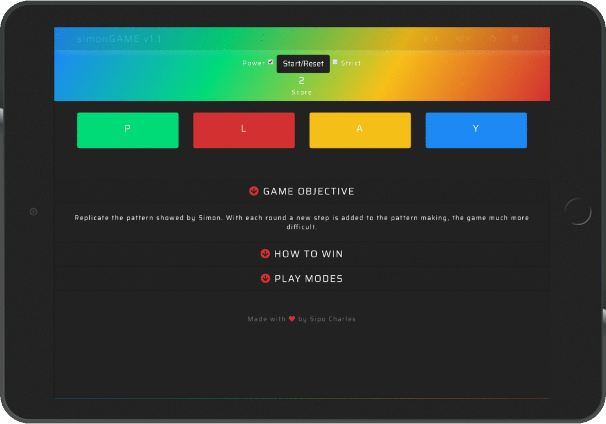
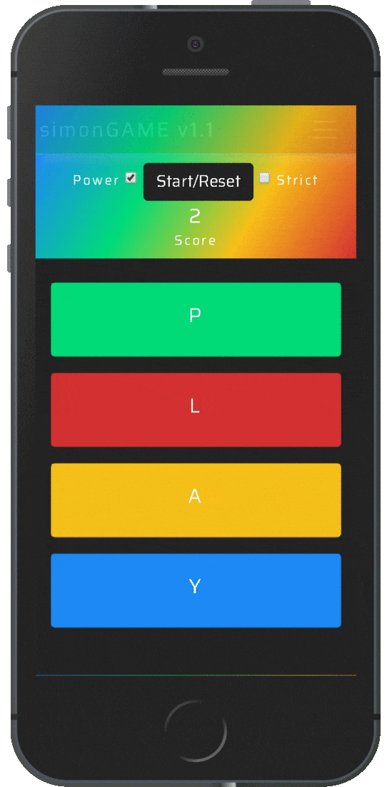

# SIMON – Memory Game

Milestone Project Two / Interactive Frontend Development / Code Institute

This is a simple single-player memory game inspired by SIMON, an electronic game of memory skill. The purpose of the game is to replicate a continually growing sequence of signals which in this rendition is displayed via a synchronised combination of musical tones and animated buttons. To find out more about the SIMON memory game, please see this brief [video](https://www.youtube.com/watch?v=1Yqj76Q4jJ4 "about SIMON") and [Wikipedia](<https://en.wikipedia.org/wiki/Simon_(game)> "more about SIMON") entry for both rules and history of the original.

#### Goal

Reproduce a simple single-player memory game, suitable for website usage, and inspired by SIMON, a classic memory game which was popular in the 1980s. The core focus of this project is on functional game logic and to be created with JavaScript.

#### Functionality

- A random series of synchronised lights & buttons are presented to the user.

- The user is required to input a sequence of synchronised lights & buttons correctly. In addition, upon valid input by the user, the same sequence of synchronised lights & buttons is replayed but with an additional step.

- Users will hear a sound that corresponds to an individual button whenever a pattern of synchronised lights & buttons plays.

- If a user inputs the wrong pattern field, they are notified by a specific sound accompanied text message which appears in the 'score tracker' display, after which point the series of synchronised lights & buttons will play again to remind the user the sequence so they may try again.

- The user can see how many steps are in the current sequence of synchronised lights & buttons to be selected.

- If a user wants to restart the game, they can select a button which grants this action; thus, returning the application back to a single step.

- The user has the option of playing in both 'Strict' mode which restarts the game whenever an incorrect field is chosen or 'Normal' mode which only repeats the pattern subsequent of the wrong button being pressed.

- The user can win the game by achieving a total of 10 correct steps, after which point the game application will salute them with a congratulations message in acknowledgement of their triumph and ends.

#### Initiation

- Research to understand what applications of similar scope were already doing in terms of functionality which provided me with a list of what I consider to be feasible options for functionality implementations to acknowledge and consider pre-production.

## UX

#### Layout

- In my opinion, Single Page Applications (SPA) are better for making responsive websites, supporting mobile devices, tablet & Desktop. Furthermore, game applications seem to demand this option as the user's attention is required to be focused on interactive events and self-triggering actions; thus, an alternative option to SPA seems counterproductive.

- No extra queries are required to the server to download pages; which consequently makes the website load faster.

- By opting for a SPA, better user-friendliness can be provided via a simple linear experience, with a clear beginning, middle, and end.

- From research looking into applications which are similar in scope to that of the project requirement, I noticed that many adopted a circular user interface (UI) style similar to that of the [original Simon (game) product](<https://en.wikipedia.org/wiki/Simon_(game)> "Demonstration: Simon game project") of allowing a user to interact, they generally had little to no page/scale responsiveness and poor rendering. In my opinion, which is subjective, of course, I feel that the design structure used for the original real-world physical Simon game product diminishes the user experience when applied to a website format. For a quick look at the UI which has been developed for the purpose of this project, please refer to the image animations below. Alternatively, you can access a live demonstration of the Simon game project application by clicking [here](https://sipostudent.github.io/Milestone-Project-2/ "Demonstration: Simon game project").

#### Tablet Display

- Please note, with the exception of a slight difference in page/scale responsiveness, desktop applies the same UI.

#### Mobile Display

- This image animation represents the typical UI across most modern mobile devices.

#### Additional Note

- Games generally require the user's to interact on a consistent basis; thus, the application is designed in a way that keeps things dense as opposed to thinly dispersed or scattered across multiple separate pages.

#### Colour Scheme

- In the original Simon (game) colours differentiated the four wide plastic arcs on the face of the device, which consisted of blue, yellow, red, and green; thus, in order to add some originality while not straying too far away from the original color scheme, a set of related colors has been utilised as an inspirational alternative to the original color choice. This entailed the following:

- Deluminate Colors

  - > #00DB78 color description: Pure (or mostly pure) cyan - lime green.
  - > #D33131 color description: Strong red.
  - > #F7BF18 color description: Vivid orange.
  - > #1D89F4 color description: Vivid blue.

- Illuminate Colors

  - > #29FF9E color description: Vivid cyan - lime green.
  - > #E07070 color description: Soft red.
  - > #FAD362 color description: Soft orange.
  - > #66AFF8 color description: Soft blue.

A color encyclopaedia provided by [ColorHexa](https://www.colorhexa.com/ "ColorHexa Official Site") was used to generate matching color palettes.

Opacity/Transparency – property to add transparency to the background of an element

- Navigation-bar

Box-shadow CSS – property to add shadow effects around an element's frame

- Navigation-bar

Linear-gradient – property to create an image consisting of a progressive transition between two or more colours along with a straight line

- Navigation-bar
- ScoreTracker & Controls Display

Hover-CSS – to display pseudo-class matches when the user interacts with an element with a pointing device but does not necessarily activate it.

- Navigation-bar

#### Font

- Being as the website is based on a digital application a square geometric sans-serif typeface choice has been used; thus, helping to emphasise a robotic tone to the displayed text content; a subjective opinion, of course.

#### Navigation

- Fixed navigation makes it easier for users to browse the website and increase retention: In some ways, it's a passive call to action; always visible, always available. As a frequent website user, I get tired of scrolling vertically and feel the need to change. People like things which save them complication and time. So, by consistently maintaining a browser bar or menu anchored while users are scrolling avoids them having to scroll up to get to the bar when they want to browse other environments, sections, content and so on.

- Maintaining the logo visible increases the brand value: Today there are an enormous number of applications, many with identical or similar features, so I feel that it’s vital to make a good impact on users and retain their interest, which can be all linked to a good brand image which in this case already exists due to the long-running popularity of the Simon (game) which this project is based.

- By having a fixed navigation with an active hover which status highlights according to what section the user is currently positioned, it makes it less likely that users will get lost and instead know where they are at all times. PLEASE NOTE: In this case, this feature is somewhat non-applicable as all application content is based on a single page, and the navigation links divert users to external websites.

#### Audio Content

The physical retail Simon (game) product has sound in addition to lighted buttons. So, for this project, a home synthesiser was used to record sounds which replicated the keys of the original game audio but utilised different sound timbres. In addition, original music jingles were created and placed to trigger at specific points in the game, either for both notification and increased user experience. These consisted of the following:

- Game Sounds

    - > btnGreen sound description: A major
    - > btnRed sound description: D major
    - > btnYellow sound description: G major
    - > btnBlue sound description: E major
    - > soundOn sound description: A sus4
    - > soundOff sound description: D M7
    - > soundCorrect sound description: D M7
    - > soundIncorrect sound description: A Dim
    - > winGame sound description: A sus4
    - > halfWaypoint sound description: B minor (this was not utilised)

- Individual Variable/DOM queries were for each sound, example, “sound1.”

- assets/sounds folder contains all of the mp3 audio files.

- Separate functions were created to play music keys and jingles.

## Technologies

- [HTML5](https://www.w3.org/TR/html5/ "HTML5 Official Site")

  - Semantic markup language as the shell of the site.

- [CSS3](https://www.w3.org/Style/CSS/ "Cascading Style Sheets Official Site")

  - Cascading Style Sheets as the design of the site.

- [jQuery](http://jquery.com/ "Cascading Style Sheets Official Site")

  - HTML document traversal and manipulation, event handling.

- [JavaScript](https://developer.mozilla.org/en-US/docs/Web/JavaScript "JavaScript Official Site")

  - Metrics

    - Function with the largest signature takes 1 argument, while the median is 0.
    - The largest function has 14 statements in it, while the median is 4.
    - The most complex function has a cyclomatic complexity value of 5 while the median is 2.

  - One unused variable
    - sound9 on line 23/index.js

- [Bootstrap - v4.1.1](https://getbootstrap.com/docs/4.1/getting-started/introduction/ "Bootstrap Official Site")

  - Utilised for developing the entire UI and consistent throughout

- [Google Fonts](https://fonts.google.com/ "Google Fonts Official Site")

  - Saira font was applied across the entire website

- [Font Awesome - v5.0.13](https://fontawesome.com/ "Fontawesome Official Site")

  - This was used for sourcing all utilised icons

#### Other Resources</h4>

- https://getbootstrap.com/
- https://www.w3schools.com/
- https://stackoverflow.com/
- https://slack.com/

## Features

Because the website utilises a 'single page’ design, all code or content is contained within just one document (index.html).

- Bootstrap navigation bar/header – allows users to navigate to external websites. These consist of Wikipedia for Simon (game) history, Hasbro where users can purchase the original game, optional, of course, and the GitHub repository of the author/developer which contains the complete source code for the application; all assets included.

- HTML hyper Links – which refers to data that the user can directly follow either by clicking and which point to a whole document or to a specific element within a document. These can be found by clicking the specific text, such as that in the navigation bar, or clicking on specific icons (Fontawesome) like those in the events and home section of the website.

- Power – A 'checkbox' allows users to toggle between having the Simon (game) application in either an activated or deactivated status. In addition, once activated, the application will remain in a standby state unless the user unticks the checkbox which prompts deactivation.

- Start/Reset – Doubles as both a game initiation and rest game score trigger.

- Strict – A checkbox function which when ticked to signify 'Strict Mode' restarts the game whenever an incorrect field is chosen. When the checkbox is unticked 'Normal Mode' is active which during gameplay only repeats the pattern subsequent to the wrong button being pressed.

- Game Levels – By default, the number of levels is to 10, but this can be altered to an integer of any number, there is no limitation.

- Sound Stabs /Musical Jingles

  1. soundOn

     - Type = Musical Jingle
     - Purpose = game activation

  2. soundOff

     - Type = Musical Jingle
     - Purpose = game deactivation

  3. soundWingame

     - Type = Musical Jingle
     - Purpose = user wins the game

  4. soundHalfwaypoint

     - Type = Musical Jingle
     - Purpose = user reaching game halfway point (currently not utilised)

  5. btnGreen

     - Type = Sound Stab
     - Purpose = Syncs with BtnGreen

  6. btnRed

     - Type = Sound Stab
     - Purpose = Syncs with BtnRed

  7. btnYellow

     - Type = Sound Stab
     - Purpose = Syncs with BtnYellow

  8. btnBlue
     - Type = Sound Stab
     - Purpose = Syncs with BtnBlue

### Features Left to Implement

- Game Tempo – should speed up incrementally, perhaps on the 5th, 9th and then if the game is set to a winning completion number of 20 as opposed to the current number of 10, then perhaps another speed increase on the 13th step, but all subject to change pre-implementation.

- Facebook Login – which would allow the storing of user details.

- Leaderboard - which would allow the storing of user identity details (name) and high scores.

- Animated icons, text, and gradient background – for transitions to connect between two visual states.

- - Game Tempo – should speed up incrementally, perhaps on the 5th, 9th and then if the game is set to a winning completion number of 20 as opposed to the current number of 10, then perhaps another speed increase on the 13th step, all subject to change pre-implementation.

- Facebook Login – which would allow the storing of user details.

- Leaderboard - which would allow the storing of user identity details (name) and high scores.

- Animated icons, text, and gradient background – for transitions to connect between two visual states.

- Pause function - so the game can be paused at any stage. This would also allow for the use of the onboard but currently not assigned 'sound9' musical jingle which was designed to signify a player reaching the 'halfway point' of the game. The game would need to pause, so not to clash with the playtime of the audio piece, but then resume it's randomised cycle of synchronised light & sound patterns once the music had ended. A text message which scrolled across the score tracker display in any direction could also be added to signify this milestone, perhaps animated for added user experience.

## Testing

#### Key Points

N/A

#### Additional Points

- Both virtual and real device tests were run to test and access the functionality of the application and identify any potential errors. In addition, and although the application UI aesthetics are not a high priority requirement for this project, the application responsiveness was also tested by resizing the window with every addition of new code. Please see below a full list of devices used in the testing phase:

- Phones

  - Galaxy Note 3 (simulated and real device)
  - Galaxy Note 9
  - Galaxy S5
  - Galaxy S9/S9+
  - iPhone 5/SE
  - iPhone 6/7/8 (simulated and real device)
  - iPhone 6/7/8 Plus
  - iPhone X
  - LG Optimus L70
  - Microsoft Lumia 550
  - Microsoft Lumia 950
  - Nexus 5X
  - Nexus 6P
  - Nokia 8110 4G
  - Pixel 2
  - Pixel 2 XL

- Tablets
  - iPad (simulated and real device)
  - iPad Mini
  - iPad Pro (10.5-inch)
  - iPad Pro (12.9-inch) (simulated and real device)
  - Kindle Fire HDX
  - Nexus 10
  - Nexus 7

* Laptops

  - MacBook Pro (simulated and real device)
  - Asus UX 305 (simulated and real device)

* Televisions
  - 1080p Full HD Television (simulated and real device)

- Website responsiveness was also tested by resizing the window with every addition of new code.

#### Tested Sections (HTML/CSS)

- External links to third party websites and code authors GitHub repository.

- Checked button sizes so they were responsive and large enough to be clicked.

- Ensuring individual section headers resized and appeared well when viewed on various device screens and added opacity to the navigation bar to allow for more visibility of section header area on smaller devices.

- Spell checked all text content.

- HTML and CSS validation via [w3.org](https://www.w3.org/ "W3C Official Site").

- Checked margins and padding of the container (sections) to ensure the content within it did not look disproportionate on various screen sizes, specifically smaller devices.

#### Tested Sections (JavaScript)

- N/A

## Deployment

- Used GitHub Pages to deploy the final version (https://sipostudent.github.io/Milestone-Project-2/).

- All tests performed prior to deployment were redone on the deployed final version.

#### Identified Issues

- N/A

#### Result

- I would suffice this was a successful deployment, all project requirements were met, and the game application has indeed proven to be functional, user-friendly, and aesthetically pleasing.

## Credits

#### Content

- All written content is bespoke and created by the code author (Sipo Charles).

#### Acknowledgements

- I received inspiration for this project from visiting [miniclip.com](https://www.miniclip.com/games/en/ "Miniclip Official Site"), and searching Google Images for Simon (game) renditions which lead me to specific compositions, but mostly from my interaction with other students on Code Institute's Full Stack Software Development Programme.
